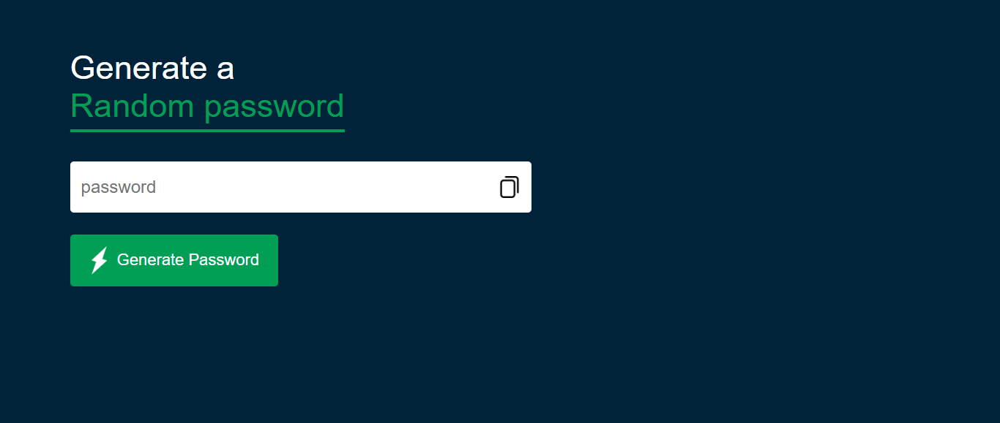

# Password Generator

A simple web application to generate secure and random passwords. This tool ensures that your passwords are strong by combining uppercase letters, lowercase letters, numbers, and symbols.



## Features
- Generate random passwords of customizable length.
- Includes uppercase letters, lowercase letters, numbers, and special symbols.
- Copy the generated password to the clipboard with one click.

## Technologies Used
- **HTML**: Structure of the application.
- **CSS**: Styling for the application layout and components.
- **JavaScript**: Logic for generating and copying passwords.

## How to Use
1. Open the Password Generator web app in your browser.
2. Click the **Generate Password** button to create a new password.
3. Click the **Copy** icon to copy the password to your clipboard.

## Installation
1. Clone this repository:
   ```bash
   git clone https://github.com/Ayman-Elfeky/Password-generator.git
